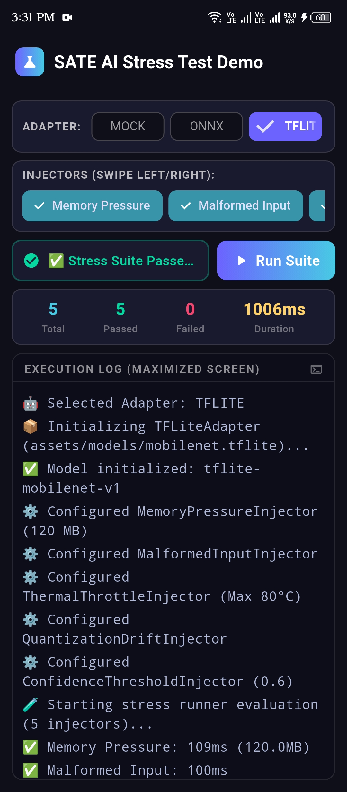
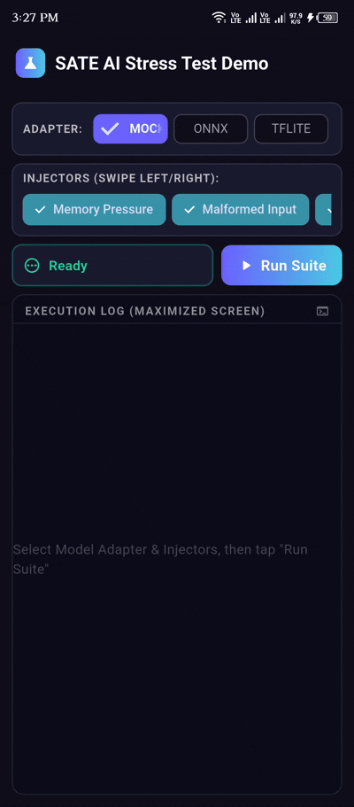
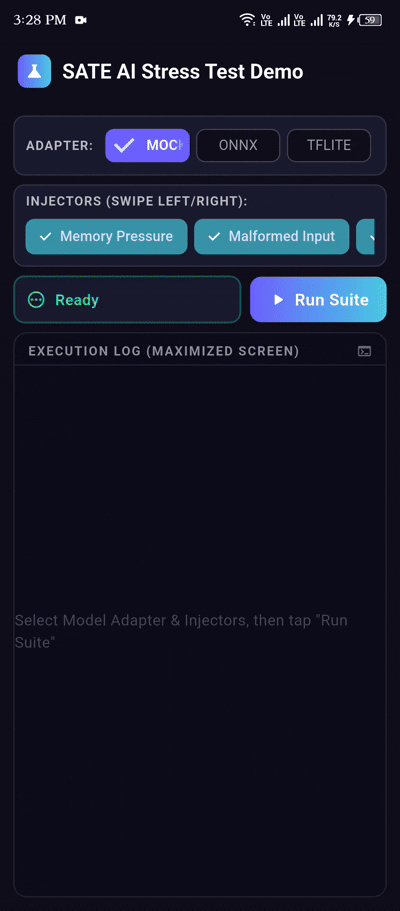
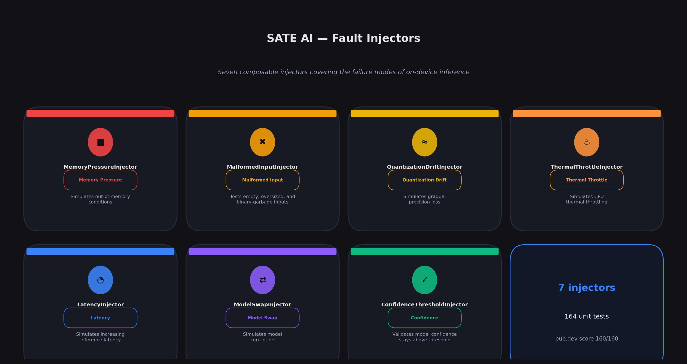
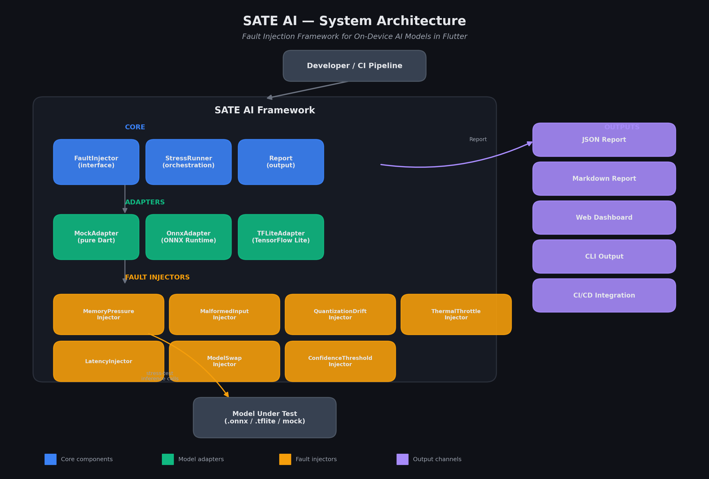
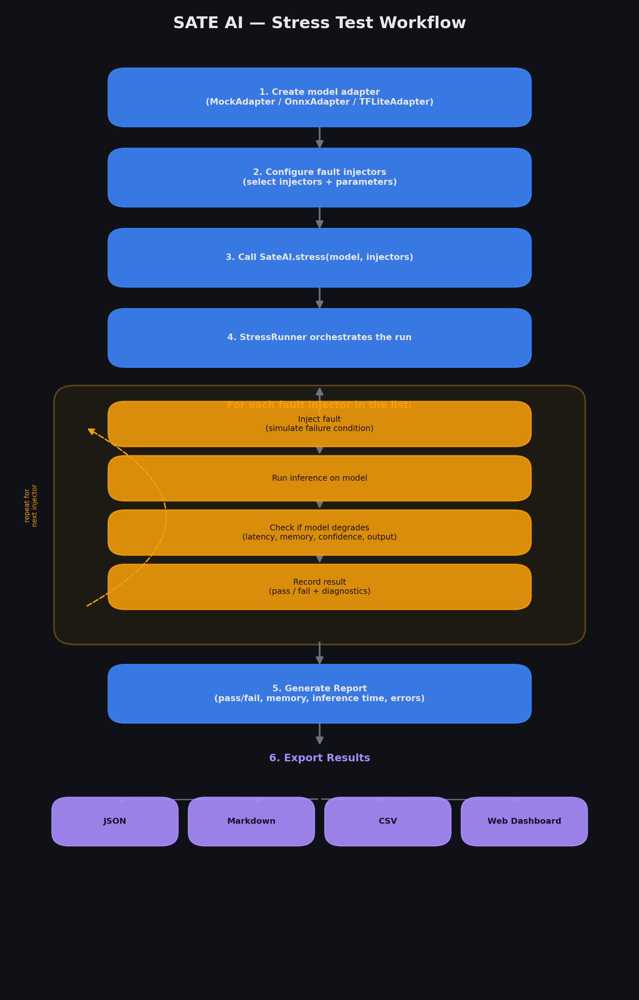

# SATE AI

Fault Injection Framework for On-Device AI Models in Flutter

[](https://assassinaj602.github.io/sate_ai)
[](https://pub.dev/packages/sate_ai)
[](https://pub.dev/packages/sate_ai/score)
[](https://pub.dev/packages/sate_ai/score)
[](https://pub.dev/packages/sate_ai/score)
[](https://github.com/assassinaj602/sate_ai/stargazers)
[](https://github.com/assassinaj602/sate_ai/actions)
[](https://opensource.org/licenses/MIT)
[](https://flutter.dev)
[](https://dart.dev)

---

## Overview

SATE AI is a fault injection framework for testing on-device AI models in Flutter applications. It simulates real-world failure scenarios — memory pressure, malformed inputs, and model degradation — so developers can validate model reliability before shipping to production.

On-device AI models (Llama, Phi, Gemma, and similar) run directly on user devices where resource constraints are unpredictable. Memory pressure causes out-of-memory crashes mid-inference. Unexpected inputs cause silent failures or exceptions. Without a structured testing approach, these issues surface only in production.

SATE AI provides a `pytest`-style experience for AI failure modes: wrap your model in an adapter, configure fault injectors, and receive a structured `StressReport` with pass/fail results, timing data, and serialization to Markdown or JSON for CI/CD pipelines.

### Key Benefits

- Identify model failures before users encounter them
- Validate error handling and recovery mechanisms in a controlled environment
- Integrate AI reliability checks into existing CI/CD pipelines
- Reduce production incidents caused by resource exhaustion or unexpected inputs
- Develop against a `MockAdapter` without requiring a real AI model

---

## 📄 Research Paper

A full research paper describing SATE AI is available:

- 📄 [Read the Paper Webpage](https://assassinaj602.github.io/sate_ai/paper.html)
- 📥 [Download PDF Version](https://assassinaj602.github.io/sate_ai/assets/pdf/paper.pdf)
- 📚 [View on arXiv](https://arxiv.org/abs/XXXX.XXXXX) *(Preprint coming soon)*

The paper covers:
- SATE AI architecture with 7 fault injectors and 3 model adapters
- 164 unit/integration tests with 160/160 pub.dev score
- Real-world mobile benchmarks with ONNX and TensorFlow Lite models

---

## Live App Demos & App Preview



| Successful Model Stress Run (`pass.gif`) | Failure Detection & Exception Report (`fail.gif`) |
|:---:|:---:|
|  |  |
| *TFLite / Mock Adapter passing all stress checks* | *ONNX Adapter catching shape mismatch failure cleanly* |

---

## Features

- Core fault injection engine with a composable `FaultInjector` interface
- `StressRunner` for orchestrating multiple injectors with timeout support
- `StressReport` with JSON, Markdown, and self-contained HTML page serialization (`toHtml()`)
- HTML report export with Chart.js charts and detailed results filtering
- `MockAdapter` for testing without real AI models
- `FllamaAdapter` for running Llama, Phi, Gemma models via llama.cpp (Fllama)
- `MemoryPressureInjector` for RAM out-of-memory simulation
- `GpuMemoryPressureInjector` for GPU VRAM pressure simulation
- `NetworkLatencyDropInjector` for simulating network latency, timeouts, and disconnections
- `DataCorruptionInjector` for simulating corrupted input data (noise, blur, occlusion, glitches)
- `ModelVersionMismatchInjector` for simulating model version mismatches and fallback
- `MalformedInputInjector` for input validation testing (empty, oversized, binary garbage)
- `SateAI.stress()` convenience API for one-call test execution
- Extensible adapter interface for wrapping any on-device AI runtime
- 246 unit tests with full coverage of core modules
- Web dashboard for visualizing stress test reports with charts and exports

---

## Installation

Add the dependency to your `pubspec.yaml`:

```yaml
dependencies:
  sate_ai: ^0.7.0
```

Then run:

```bash
flutter pub get
```

Import the library:

```dart
import 'package:sate_ai/sate_ai.dart';
```

---

## Quick Start

### Basic Usage

```dart
import 'package:sate_ai/sate_ai.dart';

Future<void> main() async {
  // Use MockAdapter during development
  final model = MockAdapter(modelId: 'my-llm-v1');

  // Run a stress test with multiple fault injectors
  final report = await SateAI.stress(
    model: model,
    injectors: [
      MemoryPressureInjector(limitMb: 100),
      MalformedInputInjector(),
    ],
    timeout: const Duration(seconds: 60),
  );

  // Check results
  if (report.passed) {
    print('✅ Model passed all stress tests.');
  } else {
    print('❌ Model failed: ${report.failureCount} failure(s) detected.');
    print(report.toMarkdown());
  }

  // Export to JSON for CI/CD
  final json = report.toJsonString();
  print(json);
}
```

### Advanced: Using Multiple Injectors

```dart
import 'package:sate_ai/sate_ai.dart';

Future<void> testWithMultipleInjectors() async {
  final model = MockAdapter(modelId: 'advanced-test');

  final report = await SateAI.stress(
    model: model,
    injectors: [
      MemoryPressureInjector(limitMb: 150),
      MalformedInputInjector(),
      QuantizationDriftInjector(
        driftFactor: 0.1,
        degradationThreshold: 0.3,
      ),
      ThermalThrottleInjector(
        model: model,
        temperatureStep: 10,
        maxTemperature: 85,
      ),
    ],
  );

  // Check individual results
  for (final result in report.results) {
    print('${result.injectorType.displayName}: ${result.passed ? "✅" : "❌"}');
    if (result.memoryUsageMB != null) {
      print('  Memory: ${result.memoryUsageMB} MB');
    }
  }

  if (!report.passed) {
    for (final failure in report.failures) {
      print('⚠️ ${failure.injectorType.displayName}: ${failure.message}');
    }
  }
}
```

### Custom Model Adapter

```dart
import 'package:sate_ai/sate_ai.dart';

class MyCustomModelAdapter implements AIModelAdapter {
  final String _modelId;
  double _currentMemoryMB = 0;
  bool _isDegraded = false;

  MyCustomModelAdapter(this._modelId);

  @override
  String get modelId => _modelId;

  @override
  double get currentMemoryMB => _currentMemoryMB;

  @override
  bool get isDegraded => _isDegraded;

  @override
  Future<AIOutput> runInference(AIInput input) async {
    // Call your model runtime here
    final startTime = DateTime.now();
    // Simulate runtime inference...
    return AIOutput(
      text: 'Mock response',
      inferenceTime: DateTime.now().difference(startTime),
      confidence: 0.95,
      metadata: const {'custom': true},
    );
  }

  @override
  Future<void> simulateMemoryPressure(int mb) async {
    _currentMemoryMB += mb.toDouble();
    if (_currentMemoryMB > 150) {
      _isDegraded = true;
    }
  }

  @override
  Future<void> reset() async {
    _currentMemoryMB = 0;
    _isDegraded = false;
  }

  @override
  Future<bool> isHealthy() async {
    return !_isDegraded && _currentMemoryMB < 150;
  }
}

void main() async {
  final model = MyCustomModelAdapter('my-custom-model');
  final report = await SateAI.stress(
    model: model,
    injectors: [MemoryPressureInjector(limitMb: 120)],
  );
  print(report.passed ? '✅ Passed' : '❌ Failed');
}
```

### Custom Fault Injector

```dart
import 'package:sate_ai/sate_ai.dart';

class CustomLatencyInjector implements FaultInjector {
  int _injections = 0;

  @override
  FaultType get type => FaultType.latency;

  @override
  String get name => 'Custom Latency Injector';

  @override
  String get description => 'Adds 100ms latency per injection';

  @override
  Future<void> inject() async {
    _injections++;
    await Future.delayed(Duration(milliseconds: 100 * _injections));
  }

  @override
  Future<void> reset() async {
    _injections = 0;
    await Future.delayed(Duration.zero);
  }
}

void main() async {
  final model = MockAdapter();
  final report = await SateAI.stress(
    model: model,
    injectors: [CustomLatencyInjector()],
  );
  print(report.passed ? '✅ Passed' : '❌ Failed');
}
```

### CI/CD Integration

```yaml
# .github/workflows/test-ai.yml
name: AI Model Testing

on: [push, pull_request]

jobs:
  test:
    runs-on: ubuntu-latest
    steps:
      - uses: actions/checkout@v3
      - uses: subosito/flutter-action@v2
      - run: flutter pub get
      - run: |
          dart run sate_ai \
            --model models/model.gguf \
            --injectors memoryPressure,malformedInput \
            --output report.json
      - name: Upload Report
        uses: actions/upload-artifact@v4
        with:
          name: ai-test-report
          path: report.json
```

### Real-World Scenario: Testing a Chatbot Model

```dart
import 'dart:io';
import 'package:sate_ai/sate_ai.dart';

Future<void> testChatbotModel() async {
  // Simulate a chatbot model
  final model = MockAdapter(modelId: 'chatbot-v1');

  // Test different failure scenarios
  final report = await SateAI.stress(
    model: model,
    injectors: [
      // Test memory pressure (OOM scenarios)
      MemoryPressureInjector(limitMb: 200),
      
      // Test malformed user inputs
      MalformedInputInjector(),
      
      // Test model quality degradation over time
      QuantizationDriftInjector(
        driftFactor: 0.15,
        degradationThreshold: 0.4,
      ),
    ],
    timeout: const Duration(seconds: 45),
  );

  // Generate a readable report
  if (report.passed) {
    print('✅ Chatbot model is reliable under stress!');
  } else {
    print('❌ Chatbot model needs improvement:');
    for (final failure in report.failures) {
      print('  - ${failure.injectorType.displayName}: ${failure.message}');
    }
  }

  // Export for documentation
  final markdown = report.toMarkdown();
  await File('chatbot-test-report.md').writeAsString(markdown);
}
```

### Real-World Scenario: Testing an Image Classifier

```dart
import 'package:sate_ai/sate_ai.dart';

Future<void> testImageClassifier() async {
  final model = MockAdapter(modelId: 'image-classifier-v1');

  final report = await SateAI.stress(
    model: model,
    injectors: [
      // Test thermal throttling (mobile devices)
      ThermalThrottleInjector(
        model: model,
        temperatureStep: 15,
        maxTemperature: 80,
      ),
      
      // Test model corruption (model swap scenario)
      ModelSwapInjector(
        initialQuality: 1.0,
        qualityDegradation: 0.2,
        qualityThreshold: 0.4,
      ),
    ],
  );

  if (!report.passed) {
    print('⚠️ Image classifier degraded under stress:');
    for (final result in report.results) {
      if (!result.passed) {
        print('  - ${result.injectorType.displayName}: FAILED');
        if (result.memoryUsageMB != null) {
          print('    Memory: ${result.memoryUsageMB} MB');
        }
      }
    }
  }
}
```

### Using the CLI

```bash
# Install the CLI
flutter pub global activate sate_ai

# Run a basic stress test
sate_ai --model model.gguf --injectors memoryPressure,malformedInput

# Run with all injectors and save report
sate_ai \
  --model model.gguf \
  --injectors memoryPressure,malformedInput,quantizationDrift,thermalThrottle \
  --output report.json \
  --timeout 60

# Get a Markdown report
sate_ai --model model.gguf --injectors memoryPressure --markdown
```

### Real-Time Monitoring Dashboard

SATE AI includes a real-time monitoring dashboard for long-running tests:

```bash
# Start the monitoring server
sate_ai --serve --port 8080

# Open http://localhost:8080 in your browser
```

The dashboard shows:
- Live progress bar
- Real-time logs
- Pass/fail counts
- Individual results as they complete

### Best Practices

1. **Start Simple**: Begin with 1-2 injectors and gradually add more.
2. **Test Early**: Run stress tests early in your development cycle.
3. **Monitor Memory**: Always check `memoryUsageMB` to catch memory leaks.
4. **Export Reports**: Save reports to track model reliability over time.
5. **Integrate with CI**: Add SATE AI to your CI/CD pipeline for automated testing.

---

## Adapters

An `AIModelAdapter` wraps any on-device AI runtime and exposes a uniform interface for running inference and inspecting model state.

| Adapter | Status | Notes |
|---|---|---|
| MockAdapter | Available | Simulates memory pressure and degradation for testing |
| OnnxAdapter | Available | Wraps `onnxruntime ^1.4.1` (Android, iOS, Linux, macOS, Windows) |
| TensorFlow Lite | Available | Wraps tflite_flutter |
| FllamaAdapter | Available | Wraps fllama for Llama-family models |
| MediaPipeAdapter | Available | Wraps Google ML Kit (MediaPipe) |
| CoreMLAdapter | Available | Wraps Apple Core ML (iOS) |
| GoogleMLKitAdapter | Available | Wraps Google ML Kit (Simulated) |

### Writing a Custom Adapter

```dart
class MyModelAdapter implements AIModelAdapter {
  @override
  String get modelId => 'my-model-v1';

  @override
  Future<AIOutput> runInference(AIInput input) async {
    // Call your model runtime here.
    final result = await myRuntime.infer(input.text);
    return AIOutput(
      text: result,
      inferenceTime: Duration(milliseconds: 120),
      confidence: 0.92,
    );
  }

  @override
  Future<bool> isHealthy() async => myRuntime.isAvailable;

  @override
  double get currentMemoryMB => myRuntime.memoryUsage.toDouble();
}
```

---

## Fault Injectors

A `FaultInjector` simulates a specific failure mode by manipulating the model adapter's state before inference runs.



| Injector | Status | Fault Type |
|---|---|---|
| MemoryPressureInjector | Available | memoryPressure |
| MalformedInputInjector | Available | malformedInput |
| QuantizationDriftInjector | Available | Simulates gradual precision loss |
| ThermalThrottleInjector | Available | Simulates CPU thermal throttling |
| LatencyInjector | Available | Simulates increasing inference latency |
| ModelSwapInjector | Available | Simulates model corruption |
| ConfidenceThresholdInjector | Available | Validates model confidence stays above threshold |

### Writing a Custom Injector

```dart
class MyLatencyInjector implements FaultInjector {
  @override
  FaultType get type => FaultType.latency;

  @override
  String get name => 'My Latency Injector';

  @override
  String get description => 'Simulates CPU throttling under sustained thermal load.';

  @override
  Future<void> inject() async {
    // Add artificial latency to simulate a throttled CPU.
    await Future.delayed(const Duration(seconds: 2));
  }

  @override
  Future<void> reset() async {
    // No persistent state to clean up.
  }
}
```

---

## Architecture



```
sate_ai/
  lib/src/
    core/
      fault_type.dart          - FaultType enum
      fault_injector.dart      - FaultInjector abstract interface
      stress_runner.dart       - Orchestration engine
      report.dart              - StressReport, FaultResult, Failure
    adapters/
      model_adapter.dart       - AIModelAdapter interface, AIInput, AIOutput
      mock_adapter.dart        - MockAdapter for testing
    injectors/
      memory_pressure_injector.dart
      malformed_input_injector.dart
  lib/sate_ai.dart             - Public API barrel export
  test/                        - 164 unit tests
  example/                     - Flutter demo application
```

### Fault Injection Execution Workflow




---

## CI/CD Integration

SATE AI is designed to run in CI/CD pipelines. Use the JSON output to fail a build when a model regresses under stress:

```dart
final report = await SateAI.stress(
  model: MyModelAdapter(),
  injectors: [
    MemoryPressureInjector(limitMb: 200),
    MalformedInputInjector(),
  ],
);

if (!report.passed) {
  // Write report artifact and exit with error code.
  File('stress_report.json').writeAsStringSync(report.toJsonString());
  exit(1);
}
```

A GitHub Actions workflow for CI is included in the repository at `.github/workflows/test.yml`.

---

## Documentation

- [API Reference](https://pub.dev/documentation/sate_ai)
- [Contributing Guide](https://github.com/assassinaj602/sate_ai/blob/main/CONTRIBUTING.md)
- [Example Application](https://github.com/assassinaj602/sate_ai/tree/main/example)
- [Changelog](https://github.com/assassinaj602/sate_ai/blob/main/CHANGELOG.md)
- [Web Dashboard](web/) - Visualize stress test reports

---

## Contributing

Contributions are welcome. Please read the [Contributing Guide](https://github.com/assassinaj602/sate_ai/blob/main/CONTRIBUTING.md) before submitting a pull request.

Good first issues are labeled [`good first issue`](https://github.com/assassinaj602/sate_ai/issues?q=is%3Aissue+is%3Aopen+label%3A%22good+first+issue%22) and cover:

- Additional fault injectors
- New model adapters (Fllama, Whisper)
- Documentation improvements
- Additional test coverage

### Development Setup

```bash
git clone https://github.com/assassinaj602/sate_ai.git
cd sate_ai
flutter pub get
flutter test
flutter analyze
```

## Command Line Interface

SATE AI provides a CLI for running stress tests from the terminal.

### Installation

```bash
flutter pub global activate sate_ai
```

### Usage

```bash
sate_ai --model path/to/model.gguf --injectors memoryPressure,malformedInput
```

Options:
- `--model, -m` – Path to model file (required)
- `--injectors, -i` – Comma-separated list of injectors
- `--timeout, -t` – Timeout per test (seconds)
- `--output, -o` – Save report to file
- `--markdown, -md` – Output as Markdown instead of JSON
- `--help, -h` – Show help

---

## License

This project is licensed under the MIT License. See the [LICENSE](https://github.com/assassinaj602/sate_ai/blob/main/LICENSE) file for the full text.

---

## Links

- [GitHub Repository](https://github.com/assassinaj602/sate_ai)
- [Issue Tracker](https://github.com/assassinaj602/sate_ai/issues)
- [Discussions](https://github.com/assassinaj602/sate_ai/discussions)
- [pub.dev Package](https://pub.dev/packages/sate_ai)
- [Changelog](https://github.com/assassinaj602/sate_ai/blob/main/CHANGELOG.md)
- [Contributors](https://github.com/assassinaj602/sate_ai/graphs/contributors)
